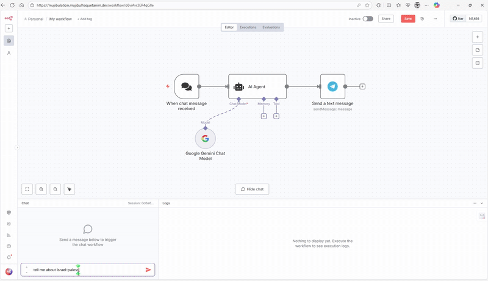

# N8N EC2 Hosting with Traefik and Docker Compose for Ubuntu 22.04 (Excution History)

Here is the excution history of N8N EC2 Hosting with Traefik and Docker Compose for Ubuntu 22.04. In this guide, we will set up N8N on an EC2 instance using Traefik as a reverse proxy and Docker Compose for container management.

**Note:** The whole process done by following n8n hosting documentation. It's just a simple excution history. The process took about 10 minutes to complete. I have added sub domain and domain in the `.env` file.

The domain is: [Traefik-N8N-EC2](https://mujibulation.mujibulhaquetanim.dev)

## Simple Automation Demo

**user_input -> Gemini LLM -> Telegram**



## Excution History

```bash
ubuntu@ip-172-*1-*4-***:~/n8n-compose$ history
sudo apt update && sudo apt-get update && sudo apt upgrade -y && sudo apt-get upgrade -y

## Add Docker's official GPG key:

sudo apt-get update
sudo apt-get install ca-certificates curl
sudo install -m 0755 -d /etc/apt/keyrings
sudo curl -fsSL https://download.docker.com/linux/ubuntu/gpg -o /etc/apt/keyrings/docker.asc
sudo chmod a+r /etc/apt/keyrings/docker.asc

## Add the repository to Apt sources:

echo "deb [arch=$(dpkg --print-architecture) signed-by=/etc/apt/keyrings/docker.asc] https://download.docker.com/linux/ubuntu \
 $(. /etc/os-release && echo "${UBUNTU_CODENAME:-$VERSION_CODENAME}") stable" | sudo tee /etc/apt/sources.list.d/docker.list > /dev/null
sudo apt-get update
sudo apt-get install docker-ce docker-ce-cli containerd.io docker-buildx-plugin docker-compose-plugin
sudo systemctl status docker
sudo systemctl start docker
sudo systemctl status docker
sudo apt update && sudo apt-get update && sudo apt upgrade -y && sudo apt-get upgrade -y
sudo apt-get update
sudo apt-get install docker-compose-plugin
docker compose version
sudo apt-get update
sudo apt-get install docker-compose-plugin
sudo usermod -aG docker ${USER}

## Register the `docker` group membership with current session without changing your primary group

exec sg docker newgrp
groups
mkdir n8n-compose
cd n8n-compose
nano .env
mkdir local-files
nano compose.yml
sudo docker compose up -d
```
