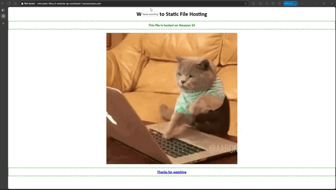

# Demo Static File Hosting on AWS S3

This demo shows how to host a static file on AWS S3. The file is hosted on Amazon S3 and can be accessed from any web browser. But it doesn't have https support. The link is `http://<bucketname>.s3-website.<region>.amazonaws.com`

note: For the security reasons, i have deleted the bucket and even gave a random name to the bucket in the demo ScreenShot.
